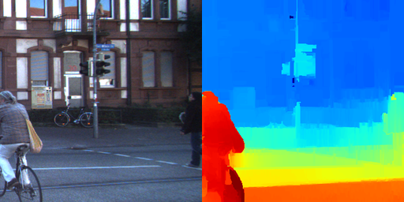
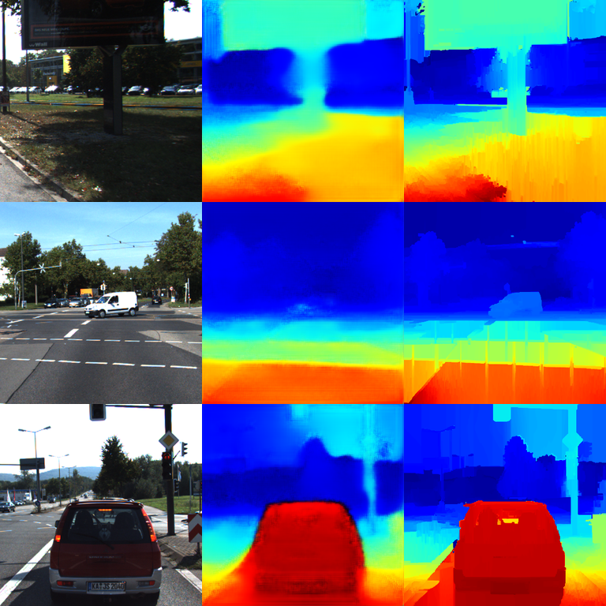
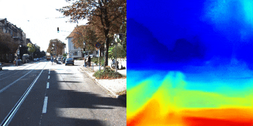
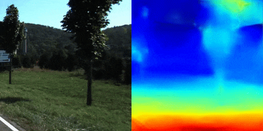

<h3 align="center">
  
</h3>

# Mono Depth Estimator

Python Jupyter notebook with TensorFlow Keras implementation for the **mono image depth prediction**.

## Usage
 
[Kaggle Notebook](https://www.kaggle.com/greg115/pix2pix-depth-estimation)

[Local Notebook](Pix2Pix-DepthEstimation.ipynb)

# How does it work?

## 1. Stereo Depth Dataset Generation

We can achieve a depth map from a pair of stereo images with the SGBM algorithm. Let's feed [stereo\_depth\_estimator](https://github.com/gsurma/stereo_depth_estimator) with [KITTI](http://www.cvlibs.net/datasets/kitti/) dataset to achieve depth maps for stereo image pairs. Then we can generate pairs of **input -> depth** by uniformly taking left or right image from the input pair and the corresponding depth map.

Full dataset available [here](https://www.kaggle.com/greg115/pix2pix-depth). Example pair:

## 2. Image-to-Image Translation with Conditional Adversarial Nets

Let's train a GAN model that learns image to image translations. We are going to use **Pix2Pix** model architecture by [Isola et al](https://phillipi.github.io/pix2pix/).

We will feed the model with **source -> destination** pairs and expect it to learn the translation between them. In our case, we are going to train the network on **input -> depth** pairs and expect it to generate depth maps for unseen inputs. 

With this approach we are going to train the network that is capable of generating a depth map for a single image.

### Training

Left column shows **source inputs**, middle column **model generated outputs** and right column **destination depth maps**. 

This is how the training progress looks over time:

We can see that over time model generated outputs are getting closer to the destination depth maps generated with stereo matching.

### Results

Inputs on the left and model generated depth maps on the right:

## Author

**Greg (Grzegorz) Surma**

[**PORTFOLIO**](https://gsurma.github.io)

[**GITHUB**](https://github.com/gsurma)

[**BLOG**](https://medium.com/@gsurma)

